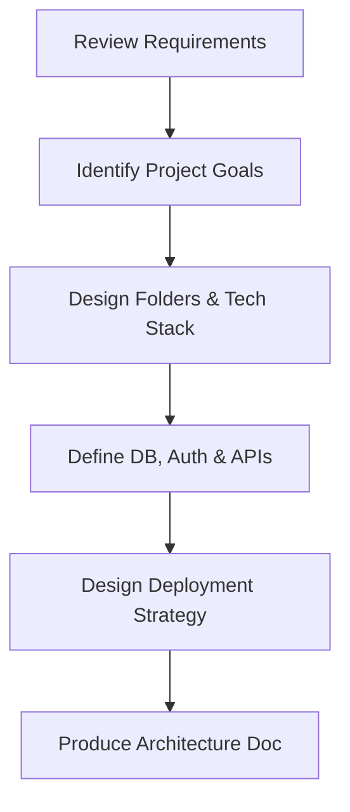

# Purpose

The Architect skill teaches a coding agent how to analyze requirements, identify project goals, and design a scalable, secure, and performant system architecture including folder structure, APIs, databases, authentication, and deployment.

# When to Use

- When starting a new feature, component, or greenfield application.
- When making load-bearing design decisions (database engine, authentication provider, architectural pattern).
- When a development step requires architectural clarification.

# When NOT to Use

- When writing simple bug fixes, unit tests, or minor style changes.
- When the overall architecture and specification have already been fully approved and documented.

# Inputs

- User feature requests or requirements specifications.
- Existing codebase structure (if applicable).
- Technical constraints (e.g. cloud provider, language limits).

# Outputs

- Architecture specification document (saved in `docs/specs/` or equivalent).
- Recommended technology stack and rationale.
- API endpoints design and database schema.

# Assumptions

- The project should follow modern engineering principles (separation of concerns, secure by design).
- The agent has read access to existing project documents and source code.

# Required Context

- Current development stack of the parent project.
- Deployment environment details (e.g., GCP, AWS, Vercel).

# Workflow

## Step-by-Step Instructions

### Step 1: Review Requirements & Identify Goals
- Analyze the user request thoroughly.
- Define functional requirements and non-functional requirements (scalability, performance, latency, security).

### Step 2: Recommend Technologies & Define Architecture
- Propose a technology stack, explaining why it fits the project goals.
- Separate frontend and backend concerns. Define if the app is a Monolith, Serverless, Microservices, or SPA/SSR setup.

### Step 3: Design Folder Structure
- Layout a clean directory structure. Avoid deeply nested files where possible.
- Group by feature or by component layer (e.g. controller/service/repository).

### Step 4: Define APIs & DB Schema
- Write out the REST, GraphQL, or RPC API endpoints with request and response payloads.
- Design the database schema (relational tables or NoSQL collections) including primary/foreign keys and indexes.

### Step 5: Design Authentication & Security
- Detail authentication flows (JWT, OAuth2, session cookies).
- Highlight security parameters (CORS, rate limiting, token expiration).

### Step 6: Design Deployment & Scaffolding
- Define deployment platforms (Vercel, Docker/K8s, GCP Cloud Run).
- Produce the final architecture specification file.

# Best Practices

- Keep architecture documents updated.
- Explain the *why* behind every technical decision.
- Prioritize developer velocity and simple, readable code structures.

# Common Mistakes

- Over-engineering: choosing complex tools (microservices, Kubernetes) when a simple monolith is sufficient.
- Hardcoding secrets or configurations in the design.
- Ignoring database indexing and authentication early in the process.

# Validation Checklist

- [ ] Requirements are fully mapped to architectural components.
- [ ] Folder structure is logically organized.
- [ ] APIs and database schemas are detailed.
- [ ] Authentication mechanism is explicitly defined.
- [ ] Target deployment strategy is defined.

# Success Criteria

- The produced specification document is complete.
- Another developer or AI agent can build the feature based purely on the generated specification.
- The validation check passes.
